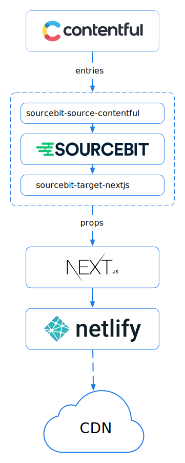

# ✨ Azimuth Next.js Contentful Theme ✨

This is Stackbit's "Azimuth" theme built with [Next.js](https://nextjs.org/) and powered by [Contentful](https://www.contentful.com).

Click the button below to create a new website from this theme using Stackbit

<p align="center">
  <a href="https://app.stackbit.com/create?theme=https://github.com/stackbit-themes/azimuth-nextjs-contentful&utm_source=theme-readme&utm_medium=referral&utm_campaign=stackbit_themes"></a>
</p>

[Live Site Demo](https://themes.stackbit.com/demos/azimuth/)


You can use this theme to create a static website hosted by a serverless deployment platform such as [Netlify](https://www.netlify.com) and content stored in [Contentful](https://www.contentful.com).

When deploying the website, [Sourcebit](https://github.com/stackbithq/sourcebit) reads the content from Contentful and provides it to Next.js and its React components via props. Once Next.js finishes generating the static website, [Netlify](https://www.netlify.com) pushes the static files to its CDN.

[Sourcebit](https://github.com/stackbithq/sourcebit) and its plugins, specifically [`sourcebit-source-contentful`](https://github.com/stackbithq/sourcebit-source-contentful) and [`sourcebit-target-next`](https://github.com/stackbithq/sourcebit-target-next), are used to read the site's contents from Contentful, normalize it, and provide it to Next.js pages. It also sets up live updates in development mode, allowing you to update the content in Contentful and instantly see your updates in the browser.

<p align="center">

</p>

## Quick Start 🏎

[Create a site](https://app.stackbit.com/create?theme=https://github.com/stackbit-themes/azimuth-nextjs-contentful&utm_source=theme-readme&utm_medium=referral&utm_campaign=stackbit_themes) from this theme using Stackbit.

Stackbit will execute the following steps for you

- Create a new GitHub repository with the contents of this repository.
- Create a new [Contentful](https://www.contentful.com) project.
- Create [Netlify](https://www.netlify.com) site connected to the GitHub repo
- Deploy the Netlify site.
- Create a Stackbit project that will allow you to edit your website via on-page visual editing experience.

Additionally, Stackbit will connect all services:

- Create a "commit" webhook in GitHub that will trigger Netlify deployment as
  soon as a new commit is pushed to GitHub.
- Create a "publish" webhook in Contentful that will trigger Netlify deployment as
  soon as content is published in Contentful.


## Editing Content 📝

Once Stackbit creates a site, you can start editing the content using the free on-page editing experience provided by the [Stackbit Studio](https://stackbit.com?utm_source=project-readme&utm_medium=referral&utm_campaign=user_themes).

[](https://stackbit.link/project-readme-lead-video)

Here's a few resources to get you started:

- 📺 &nbsp; [Editing Content](https://stackbit.link/project-readme-editing-video)
- 📺 &nbsp; [Adding, Reordering and Deleting Items](https://stackbit.link/project-readme-adding-video)
- 📺 &nbsp; [Collaboration](https://stackbit.link/project-readme-collaboration-video)
- 📺 &nbsp; [Publishing](https://stackbit.link/project-readme-publishing-video)
- 📚 &nbsp; [Stackbit Documentation](https://stackbit.link/project-readme-documentation)

If you need a hand, make sure to check the [Stackbit support page](https://stackbit.link/project-readme-support).


## Develop Locally 💻

1. [Create a site](https://app.stackbit.com/create?theme=https://github.com/stackbit-themes/azimuth-nextjs-contentful&utm_source=theme-readme&utm_medium=referral&utm_campaign=stackbit_themes) from this theme using Stackbit.

1. Stackbit will create a new GitHub repository, a [Contentful](https://www.contentful.com) project, and deploy a live site using [Netlify](https://www.netlify.com).

1. Once finished, you will be redirected to Stackbit Studio, where you will be able to edit the content using the free on-page editing experience and publish new versions of your site

1. To develop your site locally, clone the generated repository.

1. Install npm dependencies:
   
   ```shell
   npm install
   ```

1. Set the following environment variables locally.

   - `CONTENTFUL_SPACE_ID` - Contentful Space ID. You can acquire the space ID from Contentful's app URL: https://app.contentful.com/spaces/<SPACE_ID>.
   - `CONTENTFUL_PREVIEW_TOKEN` - Content Preview API - access token. You can acquire from Contentful's app in API Key's section - "Settings" => "API Keys" => "Content delivery / preview tokens" => "Add API Key" or pick one Stackbit generated for you.

1. Start the Next.js local development server:

   ```shell
   npm run dev
   ```

1. Open [http://localhost:3000/](http://localhost:3000/) in the browser. You can now edit the site code and contents in Contentful, and the browser will live-update your changes. 🎉


## Building for production 🏗

To build a static site for production, run the following command

```shell
npm run build
```

The generated site will be written to the `out` folder. The contents of this folder can be deployed by a serverless deployment platform such as [Netlify](https://www.netlify.com). You can start a local server serving the static files from the `out` folder, for example, by installing and running `http-server`:

```shell
npm install http-server -g
http-server out
```


## Contributing 🙏

To contribute to this theme, please follow the following steps:

1. Clone this repository locally

1. Create a new Space in Contentful

1. Create new Contentful Personal Access Tokens [here](https://app.contentful.com/account/profile/cma_tokens/)

1. Install dependencies

   ```shell
   npm install
   ```

1. Import the Contentful data stored in the `contentful/export.json` file to the new space by running the following command. Replace the `<management_token>` with your Personal Access Token and the `<space_id>` with the new space ID.

   ```shell
   ./contentful/import.js <management_token> <space_id>
   ```

1. Create "**Content Preview API - Access Token**" for the new space via Contentful app "Settings" => "API Keys" => "Content delivery / preview tokens" => "Add API Key".

1. Define the following environment variables to allow Next.js to fetch the content from Contentful when developing or building the site. Replace the `{SPACE_ID}` with your Space ID and the `{CPA}` with the new **Content Preview API - Access Token**.

   ```shell
   export CONTENTFUL_SPACE_ID={SPACE_ID}
   export CONTENTFUL_PREVIEW_TOKEN={CPA}
   ```

1. Lastly, run the Next.js development server:

   ```shell
   npm run dev
   ```

   Navigate to [http://localhost:3000](http://localhost:3000) to see the site.
   
1. Now you can update site code, and the content in Contentful. The browser will automatically live-update your changes.

1. Once you finish updating the code and contents, export the contents back to the `contentful/export.json` file by running the following command. Replace the `<management_token>` with your Personal Access Token and the `<space_id>` with the new space ID.

   ```shell
   ./contentful/export.js <management_token> <space_id>
   ```

1. Commit, push and submit a pull-request 🎉


## Learn More 📚

To learn more about Stackbit, take a look at the following resources:

- [Stackbit Documentation](https://www.stackbit.com/docs/)
- Configure your theme using [stackbit.yaml](https://www.stackbit.com/docs/stackbit-yaml/)

To learn more about Next.js, take a look at the following resources:

- [Next.js Documentation](https://nextjs.org/docs) - learn about Next.js features and API.
- [Learn Next.js](https://nextjs.org/learn) - an interactive Next.js tutorial.

To learn more about Contentful, take a look at the following resources:

- [Contentful Docs](https://www.contentful.com/developers/docs/)
- [Importing and exporting content with the Contentful CLI](https://www.contentful.com/developers/docs/tutorials/cli/import-and-export/)

To learn more about Netlify, take a look at the following resources:

- [Netlify Docs](https://docs.netlify.com/)
